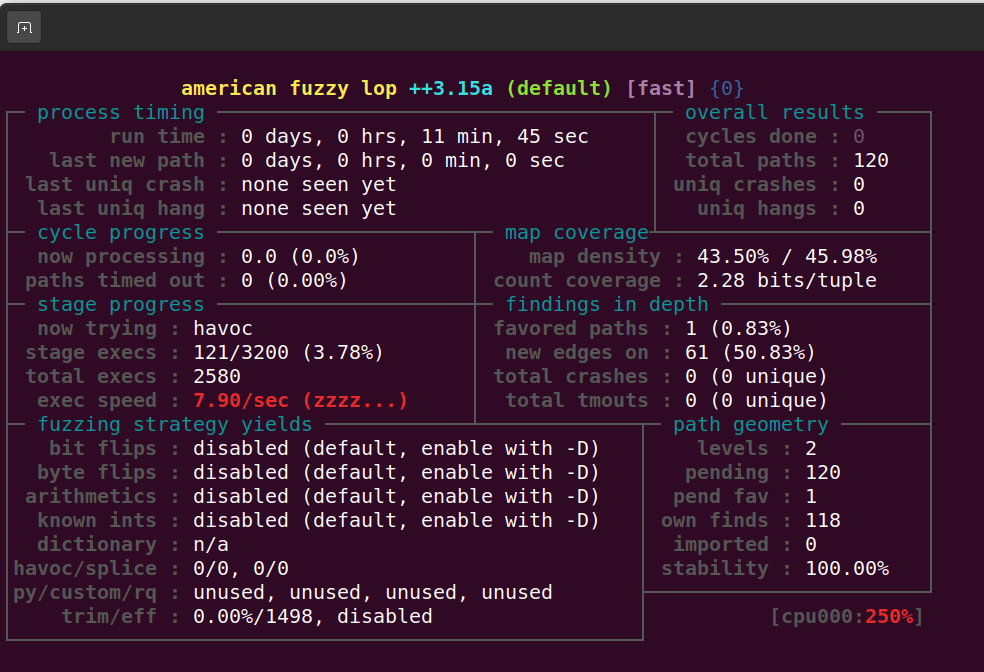

# Vue.js harness example

This project aims to be a practical example of an harness that employs
[AFL++ Injection fuzzing](https://github.com/AFLplusplus/AFLplusplus/blob/stable/instrumentation/README.injections.md) on a web application.
In particular we target a Vue.js web app that is dynamically compiled server side.
The harness is made of three components:
    1) An executor that injects tainted input in the template engine.
    2) A parser, in this case we use Libxml capabilities to read HTML input.
    3) The injection pass detector, implemented by AFLplusplus.

The injection pass uses LLVM instrumentation to add to the parser a
function that when detects an injection sample crashes to signal the
fuzzer.

## Compile

Be sure that libxml2 is already installed
```bash
# Ubuntu/Debian
sudo apt-get install libxml2-dev

# macOS (Homebrew)
brew install libxml2
```

Also check that `afl-cc` is in PATH. If not I suggest to follow the
[AFLplusplus docs](https://github.com/AFLplusplus/AFLplusplus/blob/stable/docs/INSTALL.md).
Also make sure that supertest is installed ` yarn add supertest`.
After running `make` the harness binary will be produced.

## Running

Before running the harness is necessary to set the environment variable
`FUZZER_TEST` to point to the NodeJS script that implements the tests.
In my experiment I have used s Supertest script that implements enough
tests to cover the functioning of the app.
As an example, consider the following [test
case](https://github.com/fisiognomico/gancio/blob/gh/tests/fuzzer.js) where
the HTML document of each request, originated from the input generated by
`afl-fuzz`, is saved to a folder defined at compile time.

The harness will first look for the creation of a lock file present in the
folder, which signals that all the tests have been completed.
Then each file is parsed using libxml, whose function `htmlReadMemory` is
hooked using a custom LLVM pass by AFLplusplus, as explained above.
If a specific injection pattern is detected, the harness will crash and the
triggering input is saved in the selected output folder.

### Seed generation

In my case I wanted something as simple as

```bash
openssl rand -base64 20 > input/user
openssl rand -base64 20 > input/event
```
but of course something more convoluted can be added in a future release.

Considering that we want to launch the XSS injection pass of the fuzzer,
we can simply do:

```bash
AFL_LLVM_INJECTIONS_XSS=1 afl-fuzz -i input/ -o output/ -s 1234 -- ./harness @@
```

## Troubleshooting

Before running this project please consider that it has been written with a
very specific use case in mind, and the code has been modelled to fit
the functioning of the test cases that it runs.

First of all, in case the harness does not function as expected run the
tests it is supposed to launch:
```
export AFL_USERNAME=admin
export AFL_EVENT_TITLE=test
npm test
```

Then check if a lockfile is present, if not it might be needed to create it
manually:
```bash
touch test-artifacts/tests.lock
```

Compile the harness in debug mode, and launch using a random string as
input. Check if the files present in the local folder are parsed correctly:

> Parsing: test-artifacts/homepage_123456789.html
> • Root element: html
>   • Node: head
>     • Node: title - Content: "My App"
>   • Node: body
>     • Node: div [class="container"]

## Evaluation

The approach described in this document is a practical implementation of
the AFL injection capabilities for a non-native application.
Even if the approach seems promising, the level of abstraction that
separates the fuzzer from the actual application being covered makes it
extremely difficult to get a decent coverage of the application run.
At the same time, the excessive reliance of the fuzzer on filesystem
interaction slows down every execution phase, as it relies on reading a
bunch of files from the local file system. This locks the average execution
speed to about 7exec/s, which of course is quite detrimental to get decent
coverage.


